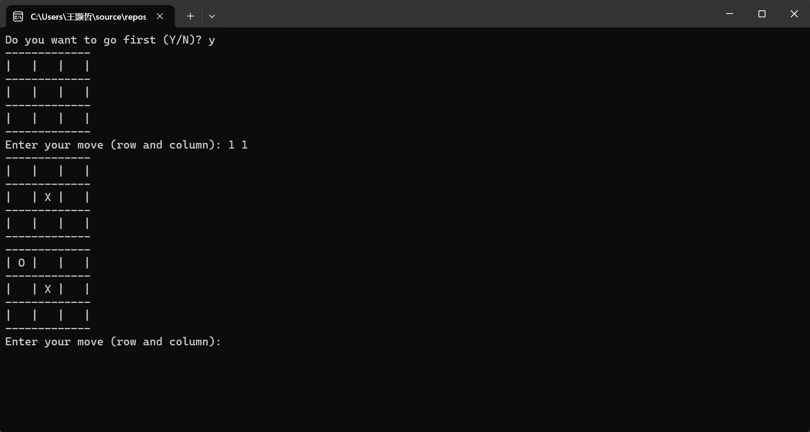

# 井字棋游戏 (Tic-Tac-Toe)

这是一个用C++实现的井字棋游戏，玩家可以与计算机对战。程序具备简单易用的用户界面，同时会记录每局比赛的结果并保存到本地文件中。

## 项目简介

该项目旨在通过C++编程语言实现经典的井字棋游戏。用户可以选择先手或后手，与计算机进行对弈。游戏支持记录每局比赛的胜负平结果，并在游戏结束后显示详细的统计信息。项目适合用于学习C++编程的初学者或作为一个简单的控制台游戏程序示例。



## 依赖项 (Dependencies)

要在Visual Studio中编译和运行这个井字棋游戏，你需要以下工具：

- **Visual Studio**：建议使用最新版本的Visual Studio，支持C++开发功能。确保安装了C++桌面开发工作负载，其中包含必要的编译器和调试工具。

## 安装流程 (Installation Process)

如果你使用的是Visual Studio，请按照以下步骤来安装并编译项目：

1. **下载项目源代码**：
   - 你可以通过`git`将项目克隆到本地计算机，或者直接下载项目压缩包并解压。
   - 使用`git`克隆命令：
     ```bash
     git clone https://github.com/your-username/tic-tac-toe.git
     ```

2. **打开Visual Studio**：
   - 启动Visual Studio，并选择`文件 > 打开 > 文件夹`，然后导航到项目文件夹并打开它。

3. **创建Visual Studio项目**：
   - 在解决方案资源管理器中，右键点击项目文件夹，选择`新建项`。
   - 选择`C++文件(.cpp)`，命名为`TicTacToe.cpp`，并将提供的源代码粘贴到文件中。

4. **配置项目**：
   - 确保项目配置为`Release`或`Debug`模式，选择相应的编译器工具集（默认即可）。

5. **编译项目**：
   - 点击`生成 > 生成解决方案`来编译项目。编译完成后，生成的可执行文件会保存在项目目录下的`Debug`或`Release`文件夹中。

6. **运行程序**：
   - 编译成功后，点击`调试 > 开始执行（不调试）`，或者直接按`Ctrl + F5`，程序将启动并在控制台窗口中运行。

## 测试运行 (Running the Test)

在Visual Studio中，你可以通过以下步骤对井字棋项目进行测试：

1. **编译并运行程序**：
   - 按照安装流程中的步骤，在Visual Studio中编译项目。确保编译过程中没有错误。
   - 编译成功后，点击`调试 > 开始执行（不调试）`，或者按`Ctrl + F5`，启动程序。

2. **测试不同的游戏场景**：
   - **玩家先手**：当程序询问是否由玩家先手时，输入`Y`，测试玩家先手的情况。确保程序正确响应玩家输入，并能够判断出胜负或平局。
   - **计算机先手**：当程序询问是否由计算机先手时，输入`N`，测试计算机先手的情况。观察计算机的移动是否符合预期，确保程序正确判断出游戏结果。
   - **无效输入**：尝试输入超出范围的行或列编号，或输入已占用的位置。确保程序提示“无效输入”，并要求重新输入。
   - **平局测试**：在不让任一方获胜的情况下完成棋盘，使其填满。确保程序正确判断为平局。

3. **检查结果文件**：
   - 游戏结束后，查看项目目录下生成的`TicTacToeResults.txt`文件。该文件记录了每局比赛的结果。
   - 确保结果文件正确记录了游戏的胜利方、平局情况，并且每次游戏结果都会追加到文件中。

4. **调试模式下进行测试**：
   - 如果需要更深入的调试和分析，可以选择`调试 > 开始调试`，或者按`F5`。在调试模式下运行程序，你可以设置断点，逐步执行代码，并观察变量的值。

通过这些测试步骤，你可以验证程序的功能是否符合预期，并确保其在不同场景下的表现是正确的。

## 使用说明 (Usage)

这个井字棋项目是一个独立的控制台应用程序。以下说明涵盖了如何使用其主要功能和API接口：

### 1. 启动游戏

- 运行编译后的可执行文件（例如，在Visual Studio中按`Ctrl + F5`）。
- 程序启动后，会提示你选择是否由玩家先手。输入`Y`表示玩家先手，输入`N`表示计算机先手。

### 2. 游戏接口 (API)

这个项目的核心功能通过类`TicTacToe`的成员函数来实现。以下是关键API的说明：

#### **类构造函数**

```cpp
TicTacToe game;
game.displayBoard();
game.playerMove();
game.computerMove();

bool game.isWin(char symbol);
bool game.isDraw();
game.saveResult("Player wins!");
game.showStatistics();
```